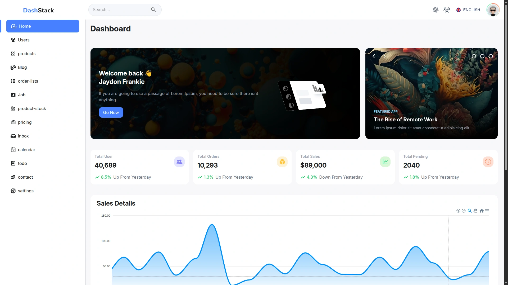
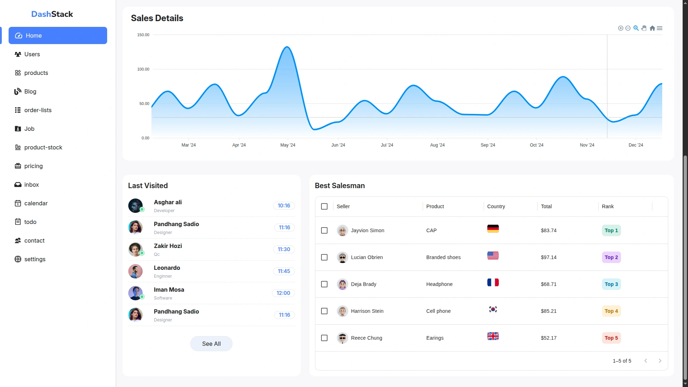
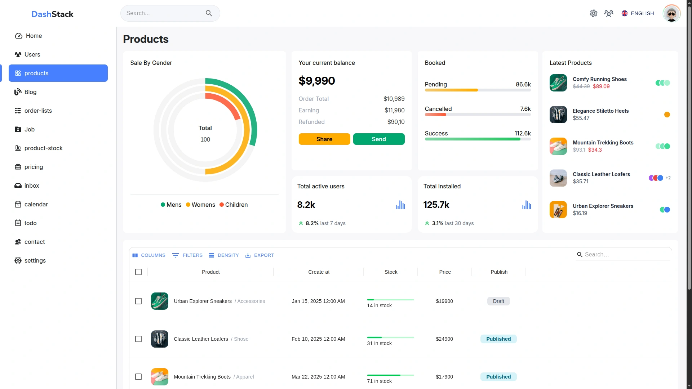
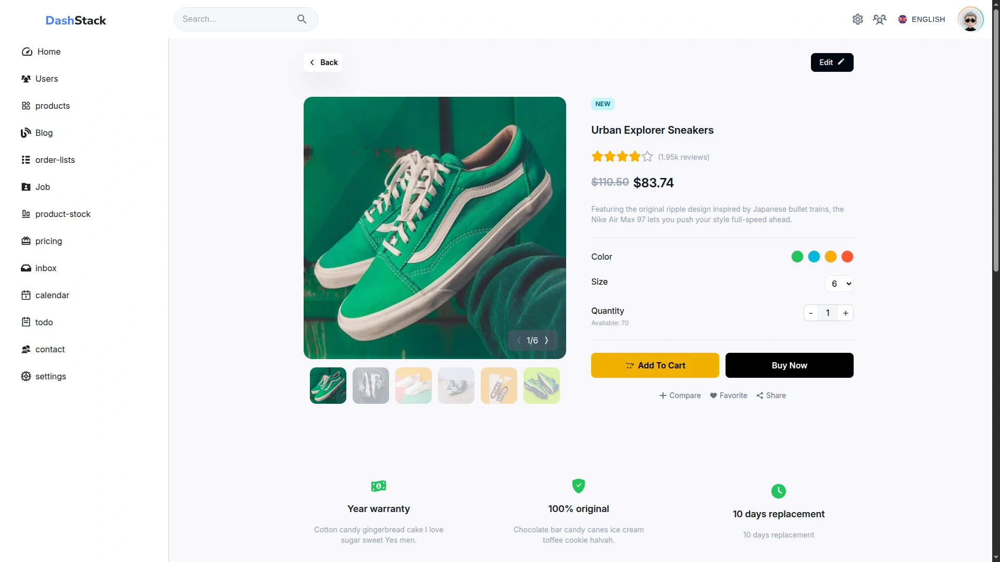
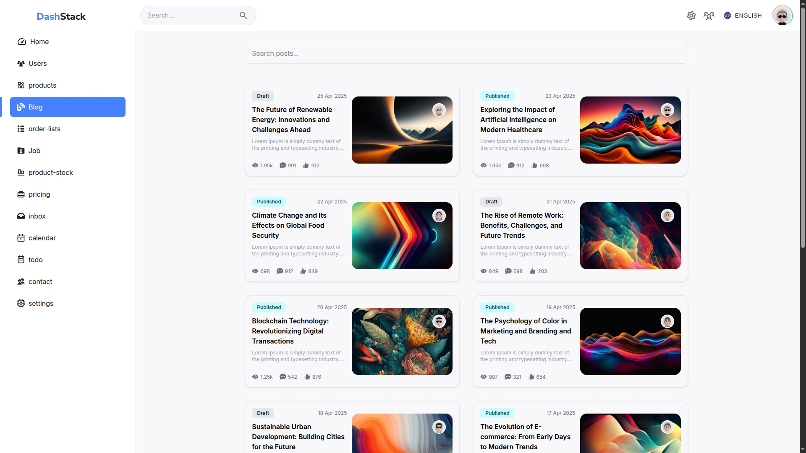
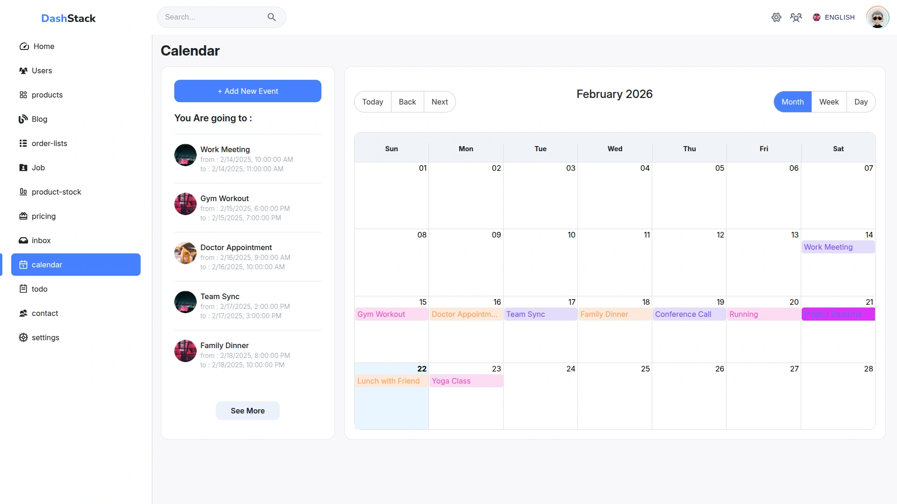
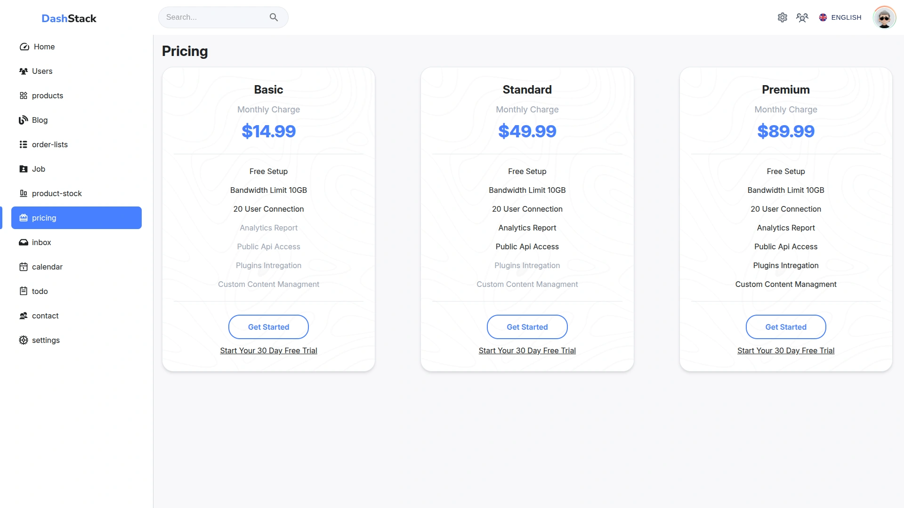
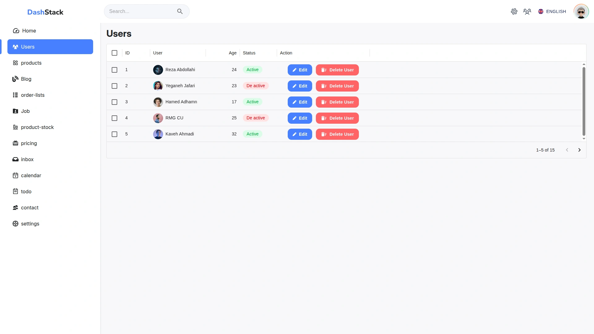
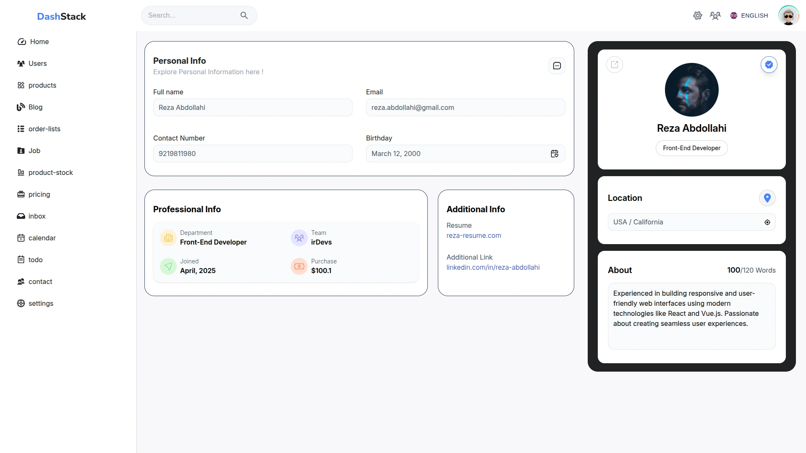

<div align="center">

# 📊 DashStack

### Professional Task Management System

[](https://reactjs.org/)
[](https://vitejs.dev/)
[](https://mui.com/)
[](https://tailwindcss.com/)
[](./LICENSE)

[English](./README.md) | [فارسی](./README.fa.md)

</div>

## 📋 About

**DashStack** is a modern, feature-rich admin dashboard template built with
React, Material UI, and TailwindCSS v4. It provides a comprehensive set of
components and pages to kickstart your admin panel development with a beautiful,
responsive, and professional UI.

**Key Features:**

- 🎨 Beautiful Material UI components with TailwindCSS styling
- 📊 Interactive charts and data visualization
- 📅 Full-featured calendar and event management
- 📋 Advanced data tables with filtering and sorting
- 🌓 Light/Dark theme support
- 📱 Fully responsive design
- ⚡ Lightning-fast development with Vite

## ✨ Features

### 📊 Dashboard & Analytics

- Real-time statistics cards
- Interactive charts (ApexCharts)
- Data visualization with multiple chart types
- Progress indicators and metrics
- Sales and revenue tracking

### 📅 Calendar & Events

- Full calendar integration (React Big Calendar)
- Event scheduling and management
- Recurring events support (RRule)
- Multiple calendar views (Month, Week, Day)
- Drag and drop functionality

### 📋 Data Management

- Advanced data grids (MUI Data Grid)
- Sorting, filtering, and pagination
- Inline editing capabilities
- Export functionality
- Bulk operations

### 🛍️ E-Commerce Features

- Product listing and management
- Product details view
- Order lists and tracking
- Inventory/stock management
- Pricing tables

### 👥 User Management

- User list with filters
- User profile pages
- Professional info items
- Contact management
- Role-based access control

### 🎨 UI Components

- Modern sidebar navigation
- Responsive data tables
- Beautiful forms and inputs
- Date/time pickers
- Icons library (React Icons)
- Toast notifications
- Modal dialogs

### 🌐 Routing & Navigation

- React Router v7 integration
- Nested routes
- Protected routes
- 404 Not Found page
- Smooth page transitions

## 🖼️ Screenshots

### Dashboard

 _Real-time statistics, KPIs and
analytics overview with interactive charts_

 _Detailed analytics
view with sales trends and performance metrics_

### Products

 _Product listing interface with
advanced filtering, sorting and inventory management_

### Product Details

 _Comprehensive
product information view with images, pricing and stock details_

### Blogs

 _Blog post management with listing,
editing and publishing controls_

### Calendar View

 _Interactive calendar with event
scheduling, recurring events and multiple views_

### Contacts

 _Contact management interface with
search, filters and quick actions_

### Pricing

 _Professional pricing tables with
plan comparison and feature highlights_

### Users

 _User management with advanced data
grid, role assignment and status controls_

### User Details

 _Individual user profile
with professional info, activity history and settings_

## ⚙️ Tech Stack

### Frontend Framework

- **React 18.3** - UI Library
- **Vite 6.0** - Build Tool & Dev Server
- **React Router DOM 7.1** - Client-side Routing

### UI Libraries

- **Material UI 6.4** - Component Library
- **MUI Icons** - Icon System
- **MUI X Data Grid 7.25** - Advanced Tables
- **MUI X Date Pickers 7.26** - Date/Time Inputs
- **TailwindCSS 4.0** - Utility-first CSS
- **React Icons 5.4** - Additional Icons

### Charts & Visualization

- **ApexCharts 4.4** - Modern Charting Library
- **React ApexCharts 1.7** - React Wrapper

### Calendar

- **React Big Calendar 1.17** - Calendar Component
- **RRule 2.8** - Recurring Events
- **Dayjs 1.11** - Date Library
- **Moment 2.30** - Date Parsing
- **Moment Timezone 0.5** - Timezone Support

### Development Tools

- **ESLint 9.17** - Code Linting
- **Prettier 3.4** - Code Formatting
- **Prettier Plugin TailwindCSS** - Class Sorting

## 🏗️ Project Structure

```
dashstack/
├── src/
│   ├── assets/                 # Static assets (images, fonts, etc.)
│   ├── components/             # Reusable components
│   │   ├── charts/            # Chart components
│   │   │   ├── Contacts.jsx
│   │   │   ├── DashboardStats.jsx
│   │   │   ├── Events.jsx
│   │   │   ├── LastProductsData.jsx
│   │   │   ├── LastVisited.jsx
│   │   │   ├── Pricing.jsx
│   │   │   ├── ProductsListTable.jsx
│   │   │   ├── ProductsStatsData.jsx
│   │   │   ├── ProgressData.jsx
│   │   │   ├── SalesData.jsx
│   │   │   ├── SidebarLinks.jsx
│   │   │   ├── UserProfessionalInfoItems.jsx
│   │   │   └── Users.jsx
│   │   └── common/            # Common UI components
│   ├── constants/             # Constants and configurations
│   ├── pages/                 # Page components
│   │   ├── Calendar/          # Calendar page
│   │   ├── Contact/           # Contact page
│   │   ├── Favorites/         # Favorites page
│   │   ├── Home/              # Dashboard/Home page
│   │   ├── Inbox/             # Inbox/Messages page
│   │   ├── NotFound/          # 404 page
│   │   ├── OrderLists/        # Orders page
│   │   ├── Pricing/           # Pricing page
│   │   ├── Products/          # Products page
│   │   ├── ProductStock/      # Inventory page
│   │   ├── Settings/          # Settings page
│   │   ├── Todo/              # Todo/Tasks page
│   │   ├── User/              # User profile page
│   │   └── UsersList/         # Users list page
│   ├── utils/                 # Utility functions
│   │   └── userUtils.jsx
│   ├── App.jsx                # Main App component
│   ├── index.css              # Global styles
│   ├── main.jsx               # Entry point
│   ├── routes.jsx             # Route configurations
│   └── theme.js               # MUI Theme configuration
├── public/                     # Public assets
├── index.html                  # HTML template
├── package.json
├── vite.config.js
└── README.md
```

## 🚀 Quick Start

### Prerequisites

- Node.js (v18 or higher)
- npm or yarn or pnpm

### Installation

```bash
# 1. Clone the repository
git clone https://github.com/yourusername/dashstack.git
cd dashstack

# 2. Install dependencies
npm install
# or
yarn install
# or
pnpm install

# 3. Start development server
npm run dev
# or
yarn dev
# or
pnpm dev

# 4. Open your browser
# Visit http://localhost:5173
```

### Available Scripts

```bash
# Development
npm run dev              # Start development server

# Build
npm run build           # Build for production
npm run preview         # Preview production build

# Code Quality
npm run lint            # Run ESLint
```

## 📄 Pages Overview

### 📊 Dashboard (Home)

- Overview statistics and KPIs
- Sales charts and analytics
- Recent activities
- Quick actions

### 📅 Calendar

- Full calendar view
- Event management
- Recurring events
- Multiple views (Month/Week/Day)

### 🛍️ Products

- Product listing with filters
- Product details
- Product statistics
- Inventory management

### 👥 Users

- User list with advanced grid
- User profiles
- Professional information
- Contact management

### 📦 Orders

- Order lists
- Order tracking
- Order details
- Status management

### 📬 Inbox

- Message management
- Email-like interface
- Read/Unread status

### ⭐ Favorites

- Favorite items
- Quick access
- Bookmarked content

### ✅ Todo

- Task management
- Todo lists
- Priority settings
- Completion tracking

### 💰 Pricing

- Pricing tables
- Plan comparison
- Feature lists

### 📦 Product Stock

- Inventory management
- Stock levels
- Low stock alerts

### ⚙️ Settings

- User preferences
- Application settings
- Profile management

## 🎨 Components

### Chart Components

- **DashboardStats** - Key metrics and KPIs
- **SalesData** - Sales charts and trends
- **ProductsStatsData** - Product analytics
- **ProgressData** - Progress indicators
- **LastProductsData** - Recent products
- **LastVisited** - Recently viewed items
- **Contacts** - Contact statistics
- **Events** - Event data visualization
- **Pricing** - Pricing charts
- **Users** - User statistics

### Table Components

- **ProductsListTable** - Advanced product table
- **UserProfessionalInfoItems** - User info display

### Common Components

- **SidebarLinks** - Navigation sidebar
- **Data Grids** - MUI X Data Grid implementations
- **Date Pickers** - MUI X Date/Time pickers

## 🌐 Routing Structure

```javascript
// Main Routes
/               → Home/Dashboard
/calendar       → Calendar
/contact        → Contact
/favorites      → Favorites
/inbox          → Inbox
/orders         → Order Lists
/pricing        → Pricing
/products       → Products
/product-stock  → Product Stock
/settings       → Settings
/todo           → Todo
/user           → User Profile
/users-list     → Users List
*               → Not Found (404)
```

## 🎯 Key Features in Detail

### 📊 Advanced Data Grid

- Sorting (multi-column)
- Filtering (quick filter, column filters)
- Pagination
- Row selection
- Column resizing
- Export to CSV/PDF

### 📅 Calendar Features

- Drag and drop events
- Recurring events (daily, weekly, monthly)
- Event categories and colors
- Timezone support
- Custom event rendering

### 📈 Charts & Analytics

- Line charts
- Bar charts
- Area charts
- Pie/Donut charts
- Mixed charts
- Real-time updates

### 🎨 Theme System

- Light/Dark mode
- Custom color palettes
- MUI theme provider
- TailwindCSS utilities
- Responsive breakpoints

## 🔧 Configuration

### Vite Configuration

Located in `vite.config.js`:

- React SWC plugin for fast refresh
- TailwindCSS v4 integration
- Build optimizations

### ESLint Configuration

- React best practices
- Hooks rules
- Refresh plugin

### Prettier Configuration

- Automatic code formatting
- TailwindCSS class sorting
- Consistent code style

## 📝 Code Examples

### Using Data Grid

```jsx
import { DataGrid } from '@mui/x-data-grid'

const columns = [
  { field: 'id', headerName: 'ID', width: 90 },
  { field: 'name', headerName: 'Name', width: 150 },
  { field: 'email', headerName: 'Email', width: 200 },
]

function MyComponent() {
  return <DataGrid rows={rows} columns={columns} pagination pageSize={10} />
}
```

### Using Calendar

```jsx
import { Calendar, momentLocalizer } from 'react-big-calendar'
import moment from 'moment'

const localizer = momentLocalizer(moment)

function CalendarPage() {
  return (
    <Calendar
      localizer={localizer}
      events={events}
      startAccessor='start'
      endAccessor='end'
    />
  )
}
```

---

## 🤝 Contributing

Contributions are welcome! Please follow these steps:

1. Fork the repository
2. Create your feature branch (`git checkout -b feature/AmazingFeature`)
3. Commit your changes (`git commit -m 'Add some AmazingFeature'`)
4. Push to the branch (`git push origin feature/AmazingFeature`)
5. Open a Pull Request

---

## 📄 License

This project is licensed under the MIT License - see the [LICENSE](LICENSE) file
for details.

---

## 👨‍ Author

**Your Name**

- GitHub: [@yourusername](https://github.com/Rezaabdollahi7)
- Email: srezaabdollahi7@gmail.com

---

## 🙏 Acknowledgments

- [React](https://reactjs.org/)
- [Material UI](https://mui.com/)
- [TailwindCSS](https://tailwindcss.com/)
- [ApexCharts](https://apexcharts.com/)
- [Vite](https://vitejs.dev/)

---

<div align="center">

**Version:** 1.0.0  
**Last Updated:** 2025  
**Status:** ✅ Production Ready

Made with ❤️ using React, MUI & TailwindCSS

</div>
```

---
